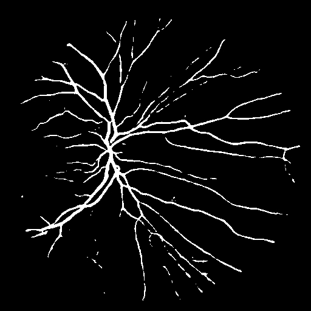

# Retina Blood Vessel Segmentation

## About the Project

This project focuses on the automatic segmentation of blood vessels in retinal fundus images using deep learning. Accurate vessel segmentation is crucial for diagnosing and monitoring various ophthalmic diseases, such as diabetic retinopathy, glaucoma, and hypertensive retinopathy. The project leverages state-of-the-art convolutional neural networks to perform pixel-wise classification, distinguishing vessel structures from the background. The solution is designed for both research and practical clinical applications, providing robust and efficient segmentation results.

The repository contains:
- A Jupyter notebook for end-to-end training, evaluation, and visualization.
- A Streamlit web application for interactive inference on new images.
- Pretrained model weights and demo media for quick experimentation.

---

## About the Dataset

The model is trained and evaluated on the [Retina Blood Vessel dataset](https://www.kaggle.com/datasets/abdallahwagih/retina-blood-vessel/data) from Kaggle. This dataset consists of high-resolution color fundus images and their corresponding binary masks, where vessel pixels are annotated by experts.

**Dataset Structure:**
- `image/`: Contains original RGB fundus images.
- `mask/`: Contains ground truth binary masks for vessel segmentation.

**Key Characteristics:**
- Images vary in illumination, contrast, and vessel visibility.
- Vessel pixels are a small fraction of the total image area, leading to class imbalance.
- The dataset is split into training and testing sets for model development and evaluation.

---

## Notebook Summary

The provided notebook (`retina-blood-vessel-segmentation-f1-score-of-80.ipynb`) guides users through the entire workflow:
1. **Problem Definition:** Outlines the clinical motivation and technical challenges.
2. **Data Preparation:** Loads images and masks, applies preprocessing (resizing, normalization), and splits data into training and validation sets.
3. **Model Selection:** Utilizes a U-Net architecture with a ResNet34 encoder pretrained on ImageNet for effective feature extraction.
4. **Loss Function & Optimizer:** Combines Binary Cross Entropy and Dice Loss to address class imbalance and improve segmentation accuracy.
5. **Training:** Implements training and validation loops with progress monitoring and checkpointing.
6. **Evaluation:** Computes metrics (F1, IoU, Precision, Recall, Accuracy) and visualizes predictions alongside ground truth.
7. **Saving:** Exports the trained model for deployment.

The notebook is modular, well-commented, and suitable for both educational and research purposes.

---

## Model Results

### Preprocessing

- **Image Normalization:** All images are scaled to [0, 1] and resized to 512x512 pixels to standardize input dimensions.
- **Mask Processing:** Masks are binarized and reshaped to match the model's output.
- **Augmentation:** (Optional) Techniques such as flipping, rotation, and brightness adjustment can be applied to improve generalization.

### Training

- **Architecture:** U-Net with a ResNet34 encoder, leveraging pretrained weights for faster convergence and better feature extraction.
- **Loss Function:** A combination of Binary Cross Entropy and Dice Loss is used to handle class imbalance and encourage overlap between predicted and true vessel regions.
- **Optimizer:** Adam optimizer with a learning rate scheduler (ReduceLROnPlateau) to adaptively reduce learning rate on validation loss plateaus.
- **Epochs:** Trained for 50 epochs with early stopping based on validation loss.

### Evaluation

- **Metrics:** The model is evaluated using F1 Score, Jaccard Index (IoU), Precision, Recall, and Accuracy.
- **Results:** Achieved an F1 score of **80%** on the test set, indicating strong performance in segmenting fine vessel structures.
- **Visualization:** The notebook provides side-by-side comparisons of original images, ground truth masks, and model predictions for qualitative assessment.

---

## How to Install

Follow these steps to set up the environment using Python's `venv`:

```bash
# Clone the repository
git clone https://github.com/DeepActionPotential/ReSegNet
cd ReSegNet

# Create a virtual environment
python -m venv venv

# Activate the virtual environment
# On Windows:
venv\Scripts\activate
# On macOS/Linux:
source venv/bin/activate


# Install required packages
pip install -r requirements.txt
```

---

## How to Use the Software


### Web Demo

1. Ensure the trained model weights are available in the `models/` directory.
2. Run the Streamlit app:
   ```bash
   streamlit run app.py
   ```
3. Upload a retinal image through the web interface and click "Run Segmentation" to see the predicted vessel mask.

### Demo Media

## [demo-video](demo/ReSegNet-demo.mp4)




---

## Technologies Used

### Model Training

- **PyTorch:** Core deep learning framework for model definition, training, and evaluation.
- **segmentation-models-pytorch:** Provides high-level implementations of popular segmentation architectures (e.g., U-Net, FPN) with pretrained encoders.
- **OpenCV & NumPy:** For image processing, augmentation, and efficient data handling.
- **Matplotlib:** Visualization of images, masks, and results.
- **scikit-learn:** Calculation of evaluation metrics (F1, IoU, Precision, Recall, Accuracy).

### Deployment

- **Streamlit:** Rapid development of interactive web applications for model inference and visualization.
- **Pillow:** Image loading and preprocessing in the web app.

These technologies ensure a robust, reproducible, and user-friendly workflow from model development to deployment.

---

## License

This project is licensed under the MIT License. See the [LICENSE](LICENSE) file for details.
